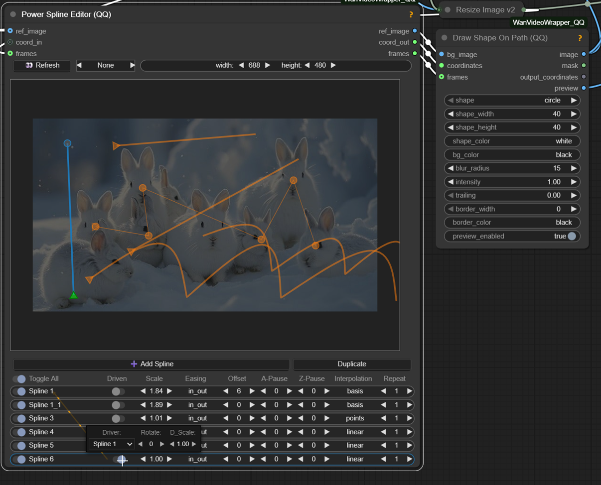

# ComfyUI-WanVideoWrapper_QQ

**Version 1.0.91** - 2025-11-24
- Optinal color match added to `Create Image List` batch node (if no ref_image connected it's not used)

https://github.com/user-attachments/assets/e1b70e5a-71af-4d01-9034-f80c9172811f

**Version 1.0.9** - 2025-11-24
- **Proper keyframes control in editor + TTM sample**: Cleaned up keyframe layer , added ref pull and animation to later be used with ttm [WF Example](examples/ttm/ttm_example_wf.json)
- From https://github.com/time-to-move/TTM , ty https://github.com/kijai/ComfyUI-WanVideoWrapper for wrapper implementation.
- [Power Spline Editor - keyframe hotkey usage](git_assets/docs/power_spline_editor.md) 

https://github.com/user-attachments/assets/41974029-4935-4952-92b6-d2d69a8873d9


**Version 1.0.8** - 2025-11-17
- **Refactor + better ATI driver control**: Slight messy refactor + proper ati point output with pause [Example](examples/ATI_buildings_wobble/ATI_buildings_wobble.json)

https://github.com/user-attachments/assets/c945432c-fe58-4783-a1c3-565e61868245


**Version 1.0.6** - 2025-11-13
- **New Wan22FMLF**: A better way to add midframe control from https://github.com/wallen0322/ComfyUI-Wan22FMLF + amplitude test in one node
- **Lora high.low filter**: Clicking the circle icon cycles through: ◎ → ◐ → ◑ → ◎ + right icon right
 click options (low/high only / both)
- **Mp4 muulti cache**: save/load steps between samplers

**Version 1.0.3** - 2025-11-07
- **New Hand-Drawn Spline Layer**: Added freeform path drawing with full animation controls. Special thanks to [filliptm](https://github.com/filliptm/ComfyUI_Fill-Nodes) for the implementation example
- **Enhanced Spline Editor Fixes**: Improved coordinate parsing, multi-spline handling, and UI fixes across canvas, context menus, and layer rendering
- **Independent Layer Point Control**: Layer points now drive independently for better animation path control

---

A collection of custom nodes for ComfyUI providing video manipulation, LoRA loading, path animation, and visual drawing tools for WanVideo workflows.

<table>
<tr>
<td width="50%">

https://github.com/user-attachments/assets/16f0da4c-38f1-4789-97dc-c331ad8a6d92
</td>
<td width="50%">

https://github.com/user-attachments/assets/5689c666-924a-4362-9788-d8f662c0d925
</td>
</tr>
</table>

### Power Spline Editor
<table>
<tr>
<td width="50%">



</td>
<td width="50%" valign="top">

[Power Spline Editor - usage](git_assets/docs/power_spline_editor.md)
- **Multi-layer canvas**: Draw unlimited paths with per-layer controls
- **Interpolation modes**: `linear`, `cardinal` (Catmull-Rom), `basis` (B-spline), `points` (static)
- **Repeat system**: Loop animations with automatic closed-path handling
- **Driver/driven**: One path controls another with rotation, scaling, and smoothing
- **Easing functions**: Smooth transitions with various easing curves for path animation
- **Right-click controls**: Context menu for driver path with additional options
- **Offset timing**: Positive/negative timing shifts with pause frame control
- **Pause frames**: Start/end pause per layer for precise animation timing
</td>
</tr>
</table>

### Power Lora Loader
<table>
<tr>
<td width="50%">


</td>
<td width="50%" valign="top">

- **LoRAs**: Dynamic UI with rgthree-style interface
- **Auto-detection**: Finds Low variant pairs from High LoRAs automatically
- **Smart patterns**: `-`, `_`, ` ` separators at prefix/suffix/infix positions
- **Case variations**: `High`/`high`/`HIGH`/`H`/`h` → `Low`/`low`/`LOW`/`L`/`l`
- **Dual strength**: Separate High (H) and Low (L) sliders with copy buttons
- **Block selection**: Per-LoRA layer control with merge and memory options
</td>
</tr>
</table>

### Wan Video VACE Frame Replace
<table>
<tr>
<td width="50%">


</td>
<td width="50%" valign="top">

[Wan Video VACE Frame Replace - example](git_assets/examples/frame_replace.json)
- **Single frames**: `5` (gray), `5+` (replacement image)
- **Ranges**: `22-26` (gray), `*1-5` (keep start), `1-5*` (keep end)
- **a-b-c patterns**: Middle frame `b` with `a` left/`c` right context
- **Multiple +**: `++a-b-c++` creates gradual duplicates on both sides
- **Custom opacity**: `++a-b-c++ 0.8` for blend strength control
- **Custom masks**: Auto-scaled replacement masks with opacity blending
</td>
</tr>
</table>

### Wan Video Cache Samples
<table>
<tr>
<td width="35%">


</td>
<td width="65%" valign="top">

- **Cache/Load workflow**: Save latent samples to disk for faster workflow iteration
- **Dual mode**: With input → cache and passthrough; Without input → load from cache
- **Auto-path handling**: Saves to node directory with customizable cache names
- **Workflow speedup**: Skip HIGH sampling steps during prompt/parameter testing to resample LOW
</td>
</tr>
</table>

### Wan Video Image To Video Encode_v2
<table>
<tr>
<td width="35%">


</td>
<td width="65%" valign="top">

- (EXPERIMENTAL) Maybe there's native ways to do this , but it seems to work
- **Multi-frame I2V**: Start/mid/end image conditioning with position control
- **Temporal feathering**: Cosine interpolation for smooth frame transitions
- **Latent strength**: Per-frame multipliers (start/mid/end) for motion control (default setting work but can be adjusted)
</td>
</tr>
</table>

### Control only vs Control + I2V
<table>
<tr>
<td width="50%">

https://github.com/user-attachments/assets/d65bb9d7-962a-4e1f-bc5d-be90adc9e311
</td>
<td width="50%">

https://github.com/user-attachments/assets/c4b70388-54a8-4b08-8f37-6028e1f2f471
</td>
</tr>
</table>

### Other Experimental Node List


## Features

- **Power LoRA Loader**: Advanced LoRA loading with High/Low pair detection, block selection, and custom UI
- **Power Spline Editors**: Multi-layer canvas-based path drawing with interpolation modes (linear, cardinal, basis, points)
- **Video Manipulation**: Speed adjustment, frame extraction, video merging, and frame replacement
- **Path Animation**: Draw shapes (circle/square/triangle) along animated paths with easing functions
- **Image-to-Video Encoding**: TAEHV (Tiny AutoEncoder for Hunyuan Video) with temporal feathering and memory-efficient modes
- **Cache Management**: Sample caching for faster workflow iteration
- **VAE Frame Replacement**: Replace specific frames in VAE-encoded video latents

## Installation

1. Navigate to your ComfyUI custom nodes directory:
```bash
cd ComfyUI/custom_nodes/
```

2. Clone this repository:
```bash
git clone https://github.com/siraxe/ComfyUI-WanVideoWrapper_QQ.git
```

3. Restart ComfyUI

## Requirements

- ComfyUI (latest version recommended)
- PyTorch with CUDA support (for GPU acceleration)
- Standard ComfyUI dependencies

## Credits

Experimental node package for WanVideo workflows in ComfyUI.

**Special Thanks**
- **KJ** - [ComfyUI-WanVideoWrapper](https://github.com/kijai/ComfyUI-WanVideoWrapper)
- **rgthree** - [rgthree-comfy](https://github.com/rgthree/rgthree-comfy)

