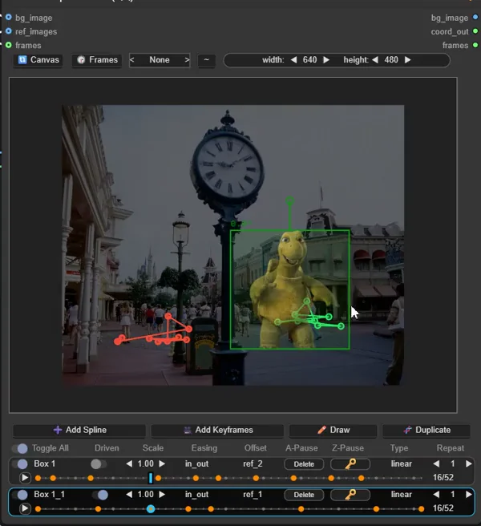
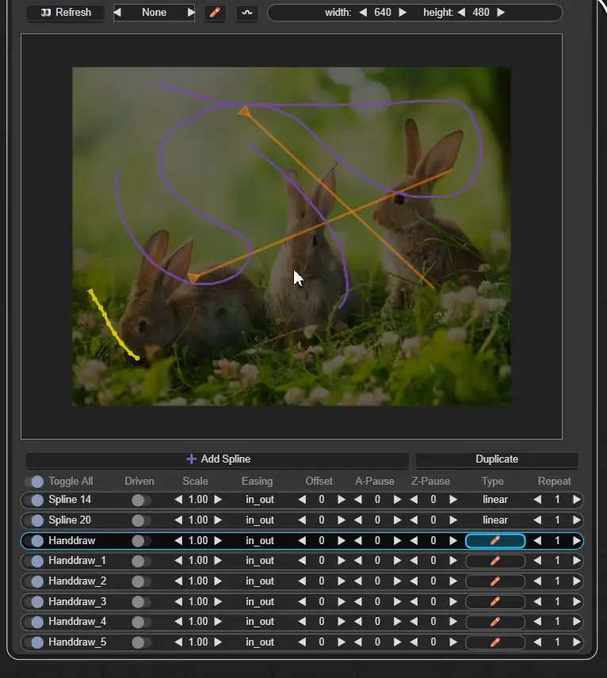

# Power Spline Editor

<table>
<tr>
<td width="35%">

</td>
<td width="65%" valign="top">

### Normal splines
- Double click - change spline layer
- Click alt + left/right/middle to rotate/scale/move curves from their base point
- Ctrl + left - add point between
- Shift + left - add next point
- Shift + middle on point - make hard point
- Shift + Left click drag on layer name to reposition it in the list

</td>
</tr>

<tr>
<td width="35%">

</td>
<td width="65%" valign="top">

### Keyframes
- S + left click - adds/removes keys in timeline and canvas (when pressed on box or point to remove) 
- Alt + right click - on object would scale it (proportionally only for now) 
- Shift + Spacebar - playback add layers (preview mode) 
- Shift + left click - on canvas scrubs selected timeline , on timetime scrubs time without moving object
- 🔃 Canvas - refreshes canvas and ref images
- 🕞 Frames - updates all timeline max frames (or squeezes currnt keyframes if last key is < than new max)

</td>
</tr>

<tr>
<td width="35%">

</td>
<td width="65%" valign="top">

### Draw type splines
- Right click ui has edit button
- Middle click on canvas stops edit/create mode

</td>
</tr>

<tr>
<td width="35%">

</td>
<td width="65%" valign="top">

- Change node size (doestn affect output)
- Right click on canvas for options
- Right click on layers to remove/move them
- Right click on driven toggle to assign a "driver" (layer name)

</td>
</tr>
</table>
