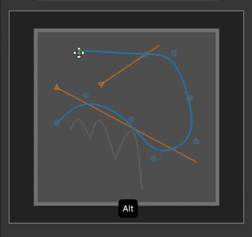
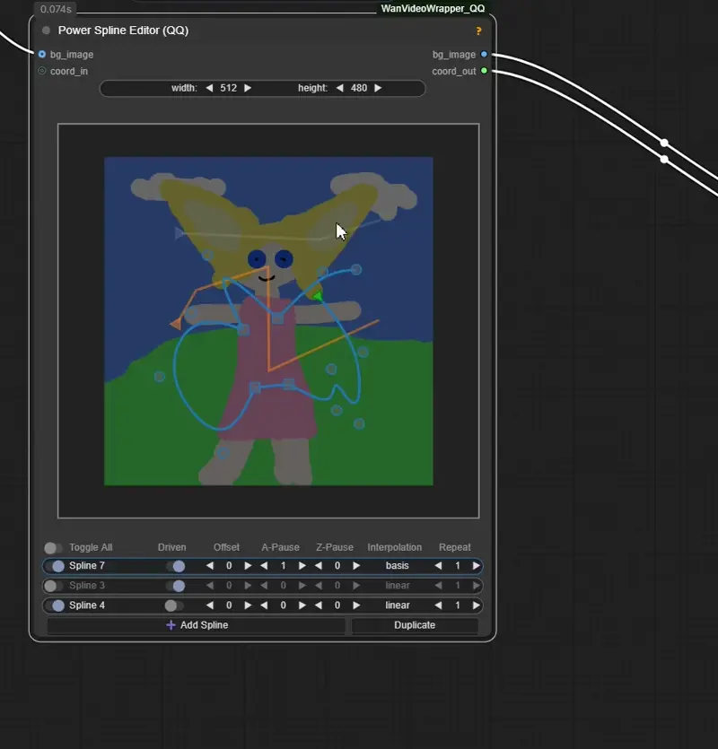

# Power Spline Editor

<table>
<tr>
<td width="35%">

</td>
<td width="65%" valign="top">

### All splines
- Double click - change spline layer
- Click alt + left/right/middle to rotate/scale/move curves from their base point
- Ctrl + left - add point between
- Shift + left - add next point
- Shift + middle on point - make hard point
### Draw type splines
- Right click ui has edit button
- Middle click on canvas stops edit/create mode

</td>
</tr>
<tr>
<td width="35%">

</td>
<td width="65%" valign="top">

- Change node size (doestn affect output)
- Right click on canvas for options
- Right click on layers to remove/move them
- Right click on driven toggle to assign a "driver" (layer name)

</td>
</tr>
</table>
